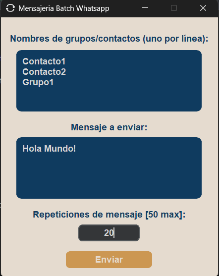

# Mensajería WhatsApp por Lotes

Esta pequeña app en Python permite enviar mensajes **instantáneos** en batch a contactos o grupos de WhatsApp Web, con interfaz gráfica basada en CustomTkinter y Selenium.

## Captura de pantalla


---

## 📋 Requisitos

- Python 3.8+
- Google Chrome (versión X.Y – mira `chrome://version/`)
- `chromedriver.exe` compatible en `chromedriver-win64/chromedriver.exe`
- Paquetes Python:
  ```bash
  pip install -r requirements.txt


